# Conteúdo completo das aulas — Aprendizz

> Documento gerado a partir do currículo oficial do LMS para avaliação pedagógica.
> Curso: **Backend Empregável** (`backend-node-ts`)

## Sumário

- **Módulo 1:** Fundação e a Web
  - 1. [Aula: Estratégia: Node.js + TypeScript + PostgreSQL](#estrategia-stack)
  - 2. [Aula: Como a Web funciona: HTTP na prática](#http-fundamentos)
  - 3. [Aula: O que acontece numa requisição (AondeTem)](#fluxo-requisicao)
  - 4. [Aula: Node.js e TypeScript no Backend](#node-typescript-backend)
  - 5. [Avaliação: Avaliação — Fundação e a Web](#avaliacao-mod-1)
- **Módulo 2:** APIs e Bancos de Dados
  - 6. [Aula: Construção de APIs REST](#apis-rest)
  - 7. [Aula: PostgreSQL e SQL de verdade](#postgresql-sql)
  - 8. [Aula: Integração API + PostgreSQL](#api-banco-integracao)
  - 9. [Avaliação: Avaliação — APIs e Bancos](#avaliacao-mod-2)
- **Módulo 3:** Segurança e Qualidade
  - 10. [Aula: Autenticação e autorização](#auth-autorizacao)
  - 11. [Aula: Testes automatizados](#testes-automatizados)
  - 12. [Aula: Git e fluxo profissional](#git-fluxo-profissional)
  - 13. [Avaliação: Avaliação — Segurança e Qualidade](#avaliacao-mod-3)
- **Módulo 4:** Mercado e Portfólio
  - 14. [Aula: Docker na prática](#docker-containers)
  - 15. [Aula: Deploy e produção](#deploy-producao)
  - 16. [Aula: Projeto: API de comércios locais](#projeto-api-comercios)
  - 17. [Aula: Ciclo de estudos e entrevistas](#ciclo-estudo-entrevistas)
  - 18. [Avaliação: Avaliação — Mercado e Portfólio](#avaliacao-mod-4)

---

# Curso: Backend Empregável

## O que você vai construir

Esta matéria transforma o que você já sabe (TypeScript, web, APIs) em **base de Backend júnior**: HTTP, Node, SQL, autenticação, testes, Git, Docker e deploy.

O foco não é acumular definições. É sair de cada aula **conseguindo explicar e defender** decisões — o que entrevistas e o primeiro emprego cobram de verdade.

### Como o caminho funciona

1. **Curso** — o programa completo (esta página)
2. **Módulo** — um bloco coerente de estudo
3. **Aula** — explicação com trade-offs + exercícios de fixação
4. **Avaliação** — 10 questões cobrindo o módulo inteiro

O roadmap só explica a rota. Prática e notas ficam nas aulas e nas avaliações.

---

# Módulo 1: Fundação e a Web

*Estratégia da stack, HTTP de verdade, o fluxo de uma requisição e Node.js + TypeScript no servidor.*

<a id="estrategia-stack"></a>

## 1. Aula: Estratégia: Node.js + TypeScript + PostgreSQL

- **Slug:** `estrategia-stack`
- **Tipo:** aula
- **Liberada por padrão:** sim

### Objetivos de aprendizagem

- Explicar por que esta stack faz sentido para empregabilidade júnior
- Separar o que entra agora do que fica para depois

### Conteúdo

## Por que esta matéria existe

Você não precisa “aprender o mundo” antes da primeira vaga. Precisa de uma **base profunda o suficiente** para construir, explicar, testar e publicar uma API — e defender essas escolhas numa entrevista.

## A escolha da stack

| Peça | Papel |
|---|---|
| TypeScript | Tipagem e clareza no servidor |
| Node.js | Runtime JavaScript no Backend |
| PostgreSQL | Dados relacionais com SQL real |
| Express (ou similar) | API HTTP |
| Git, testes, Docker, deploy | Prática de time real |


## Por que isso importa

No mercado brasileiro de vagas júnior, **Node + TypeScript + PostgreSQL** aparece com frequência em startups e times de produto web. Recrutadores querem ver no GitHub: uma API com rotas claras, SQL (mesmo simples), auth, testes e README que explique decisões — não uma coleção de tutoriais incompletos.

Comparações mentais úteis:

- **Só Express + Mongo**: sobe rápido, mas você adia modelagem relacional e SQL — e muitas entrevistas cobram JOIN, índice e transação.
- **Só Nest “no automático”**: o framework organiza, mas se você não entende HTTP, camadas e o banco, vira decorators sem discurso.

## O que fica de fora (por enquanto) — e por quê

Microsserviços, Kubernetes e “toda a AWS” não são o teto da casa — são o telhado. Sem fundação, você só repete buzzwords.

## O que quebra se fizer errado

- Trocar de stack a cada duas semanas → portfólio raso e zero profundidade para entrevista.
- Pular SQL “porque o ORM resolve” → trava em bug de produção e na pergunta de JOIN.
- Estudar só vídeo sem publicar API → você “conhece os nomes”, mas não defende decisões.

## Exemplo um pouco mais rico — definição de pronto

Uma feature só está pronta quando você consegue:

1. Descrever o endpoint, o status code e o contrato JSON
2. Mostrar a query ou a regra de negócio (mesmo que ainda em memória)
3. Dizer como testaria o **caso de erro** (400/401/404/500)
4. Explicar em 30 segundos *por que* fez assim (e o que deixou de fora)

### Exercícios

#### Múltipla escolha

**Q1.** Qual é o objetivo principal desta matéria?

- (a) Dominar Kubernetes antes de qualquer API
- (b) Construir, explicar, testar e publicar uma API completa ✅ **(gabarito)**
- (c) Trocar de linguagem a cada semana

**Q2.** O que fica de fora no início?

- (a) SQL e HTTP
- (b) Microsserviços e Kubernetes ✅ **(gabarito)**
- (c) TypeScript

**Q3.** PostgreSQL entra nesta fase principalmente para:

- (a) Substituir Git
- (b) Modelar e consultar dados com SQL real ✅ **(gabarito)**
- (c) Renderizar CSS

#### Questão de texto livre

Explique para um tech lead: por que Node + TypeScript + PostgreSQL é uma boa aposta para vaga júnior no seu contexto? Compare mentalmente com “só Express + Mongo” ou “só Nest”. O que você deliberadamente NÃO vai estudar nesta fase — e por quê?

> Corrigida por agente de IA (pass/fail + feedback pedagógico).


<a id="http-fundamentos"></a>

## 2. Aula: Como a Web funciona: HTTP na prática

- **Slug:** `http-fundamentos`
- **Tipo:** aula

### Objetivos de aprendizagem

- Explicar cliente, servidor, request e response
- Reconhecer métodos, headers, status e JSON

### Conteúdo

## Cliente e servidor

O **cliente** (browser, app, Insomnia) inicia a conversa. O **servidor** escuta, processa e responde. HTTP é o idioma dessa conversa.

## Anatomia de uma requisição

- **Método**: GET, POST, PUT, PATCH, DELETE
- **URL + query**: caminho e filtros (`?page=1`)
- **Headers**: metadados (Content-Type, Authorization)
- **Body**: carga útil (geralmente JSON em APIs)

## Status codes com significado

| Código | Ideia |
|---|---|
| 200 | OK |
| 201 | Criado |
| 400 | Pedido inválido |
| 401 | Não autenticado |
| 403 | Sem permissão |
| 404 | Não encontrado |
| 500 | Erro no servidor |

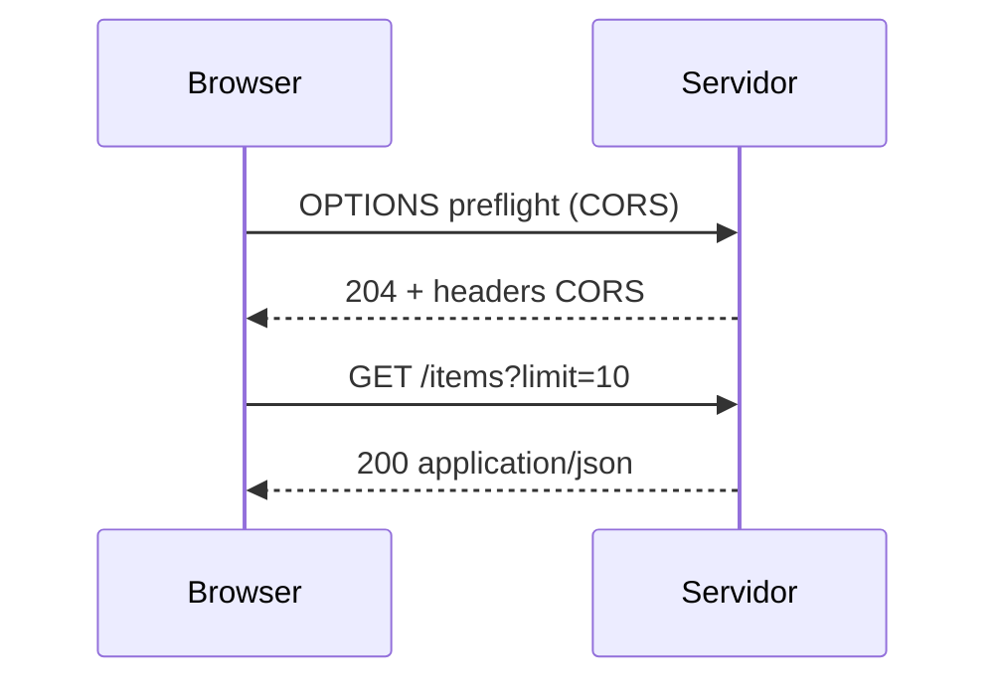

## Por que isso importa

Em produção e em entrevista, status code **semântico** comunica o contrato: o cliente sabe se deve retry, pedir login, ou mostrar “não encontrado”. “Sempre 200 com `{ ok: false }` no body” esconde falhas, quebra monitoramento e confunde o frontend.

## Ciclo real (além do GET feliz)

1. Browser resolve DNS e abre conexão TLS (HTTPS)
2. Se for cross-origin “não simples”, pode haver **preflight** OPTIONS
3. Request chega com método, headers e body
4. Servidor valida, executa regra, responde status + body
5. Browser aplica CORS; se headers CORS falharem, o JS nem lê a resposta

## O que quebra se fizer errado

- Devolver 200 para erro de validação → frontend e logs mentem.
- Ignorar CORS → “funciona no Postman, quebra no browser” (clássico de quem veio do frontend).
- Confundir 401 com 403 → o time de produto trata login e permissão do mesmo jeito.

## Exemplo um pouco mais rico

```http
OPTIONS /api/businesses HTTP/1.1
Origin: https://app.exemplo.com
Access-Control-Request-Method: POST
```

```http
POST /api/businesses HTTP/1.1
Host: api.exemplo.com
Origin: https://app.exemplo.com
Content-Type: application/json

{"name":""}
```

Resposta correta (pedido inválido), não “200 com erro escondido”:

```http
HTTP/1.1 400 Bad Request
Content-Type: application/json

{"error":"name_required"}
```

### Exercícios

#### Múltipla escolha

**Q1.** 404 indica principalmente:

- (a) Não autenticado
- (b) Recurso não encontrado ✅ **(gabarito)**
- (c) Erro interno genérico

**Q2.** Query parameters ficam:

- (a) Na URL após ? ✅ **(gabarito)**
- (b) Somente no body
- (c) No certificado TLS

#### Questão de texto livre

Explique para um entrevistador o caminho de uma requisição do navegador até o servidor e de volta, citando preflight/CORS quando fizer sentido. Por que “sempre devolver 200” é uma má ideia? Dê um exemplo com método, status e JSON.

> Corrigida por agente de IA (pass/fail + feedback pedagógico).

#### Exercício de código

Implemente `isSuccessStatus(code)` (2xx) e `describeStatus(code)` com 200→ok, 201→created, 400→bad_request, 401→unauthorized, 403→forbidden, 404→not_found, 500→server_error, outros→unknown. Trate apenas números; o contrato importa tanto quanto a função.

**Código inicial:**

```ts
export function isSuccessStatus(code: number): boolean {
  return false
}
export function describeStatus(code: number): string {
  return 'unknown'
}
```

**Testes automatizados:**

- `200 success`
- `404 fail`
- `describe 401`


<a id="fluxo-requisicao"></a>

## 3. Aula: O que acontece numa requisição (AondeTem)

- **Slug:** `fluxo-requisicao`
- **Tipo:** aula

### Objetivos de aprendizagem

- Narrar Frontend → API → Banco → JSON → UI
- Explicar por que o browser não fala com o banco com credenciais admin

### Conteúdo

## Cenário

No AondeTem, o usuário clica numa loja. Quase todo Backend júnior gira em torno desse tipo de fluxo — e das **falhas** no meio do caminho.

## Passo a passo (caminho feliz)

1. Frontend pede os dados da loja
2. HTTP chega na API
3. Backend valida e interpreta
4. Backend consulta o banco
5. Banco devolve linhas
6. Backend responde JSON
7. Frontend renderiza

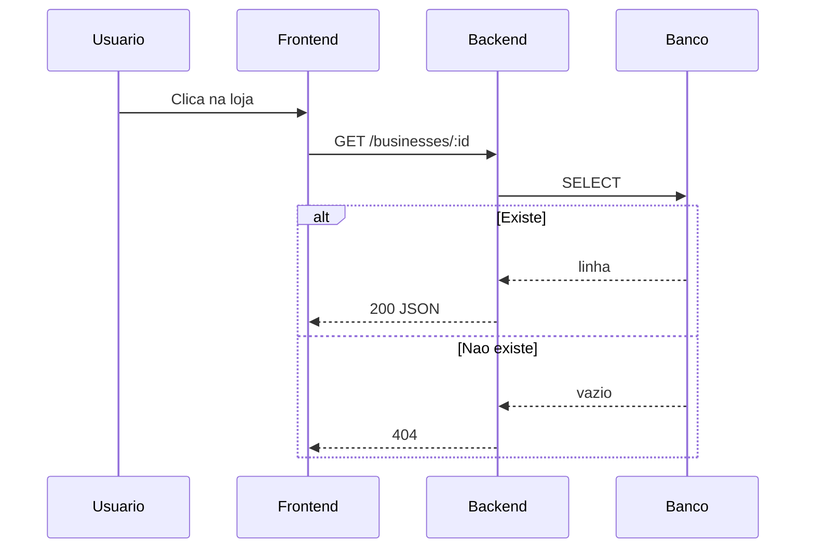

## Por que isso importa

Quem veio do frontend tende a pensar “chamei a API e veio o JSON”. Em Backend, o valor está em **mapear falhas** para status e mensagens estáveis — e em nunca confiar no client.

## Pontos de falha (o que o frontend recebe)

| Falha | Resposta típica |
|---|---|
| id inválido / UUID malformado | 400 + `{ error: "invalid_id" }` |
| loja não existe | 404 + `{ error: "business_not_found" }` |
| timeout / banco fora | 503 ou 500 + erro genérico (sem vazar SQL) |
| JSON do body quebrado no POST | 400 + `invalid_json` |
| credencial de banco no client | **incidente de segurança** |

## Regra de confiança + ataque simples

Se o frontend tivesse a connection string admin, qualquer usuário abre o DevTools, copia o segredo e lê/apaga dados. O Backend é a **fronteira de confiança**: valida identidade, aplica autorização e fala com o banco.

## O que quebra se fizer errado

- Devolver 500 para “não encontrado” → monitoramento grita sem necessidade e o UX fica genérico.
- Espelhar erro de SQL no JSON → vaza schema e ajuda atacante.
- Colocar service role / senha do banco no Vite → vazamento permanente no bundle.

## Exemplo um pouco mais rico — contrato

```ts
type Business = { id: string; name: string; address: string }

// 200
{ "id": "b1", "name": "Café Norte", "address": "Rua A, 10" }

// 404
{ "error": "business_not_found" }

// 400
{ "error": "invalid_id" }
```

### Exercícios

#### Múltipla escolha

**Q1.** Quem deve usar credenciais privilegiadas do banco?

- (a) O Frontend
- (b) O Backend / API ✅ **(gabarito)**
- (c) O CSS

**Q2.** Comércio inexistente tipicamente retorna:

- (a) 200 com lista completa
- (b) 404 ✅ **(gabarito)**
- (c) 301 para o Google

#### Questão de texto livre

Explique para um tech lead por que você NÃO deixaria o frontend acessar o banco com credenciais privilegiadas. Inclua:
1. Função do Frontend vs Backend neste fluxo
2. O que é a requisição HTTP neste cenário
3. Um exemplo simples de abuso se o segredo vazar no client
4. O que o frontend deve receber se o comércio não existir (status + body)

> Corrigida por agente de IA (pass/fail + feedback pedagógico).

#### Exercício de código

Implemente `notFoundResponse()` → `{ status: 404, body: { error: "business_not_found" } }` e `okBusiness(name)` → status 200 com `{ name }`. O contrato (status + body) é o que o frontend consome.

**Código inicial:**

```ts
export function notFoundResponse() {
  return { status: 0, body: { error: '' } }
}
export function okBusiness(name: string) {
  return { status: 0, body: { name: '' } }
}
```

**Testes automatizados:**

- `404`
- `200`


<a id="node-typescript-backend"></a>

## 4. Aula: Node.js e TypeScript no Backend

- **Slug:** `node-typescript-backend`
- **Tipo:** aula

### Objetivos de aprendizagem

- Diferenciar frontend e backend em TypeScript
- Usar módulos, async/await e variáveis de ambiente

### Conteúdo

## Node.js em uma frase

É o **runtime** que executa JavaScript/TypeScript fora do browser — ideal para APIs, workers e scripts.

## Diferenças práticas FE vs BE

| Frontend | Backend |
|---|---|
| DOM, UI, UX | I/O, banco, regras de negócio |
| Segredos nunca no bundle | Secrets em env no servidor |
| Falha visível ao usuário | Falha vira log + status HTTP |
| Re-render | Throughput, latência, estabilidade |

## Por que isso importa

No servidor, um erro não tratado pode derrubar o processo (ou deixar request pendurada). Tipagem forte e env vars importam **mais** no Backend: um typo em `DATABASE_URL` ou um `undefined` em query explode em produção para todos os usuários, não só na sua tela.

## Event loop e async/await (sem mágica)

Node é ótimo em I/O concorrente: enquanto espera o banco, o event loop atende outras requests. `async/await` não cria threads novas por si só — ele organiza Promises. Bloquear CPU pesada no handler (loop gigante síncrono) atrasa **todo mundo**.

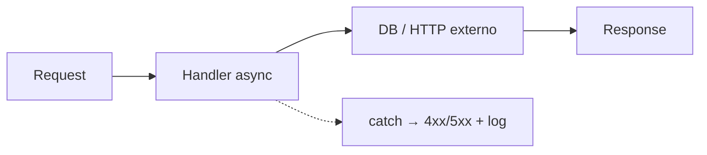

## O que quebra se fizer errado

- Promise rejeitada sem `catch` / sem handler de `unhandledRejection` → processo instável.
- Commitar `.env` com senha → vazamento + rotação urgente.
- Tratar async como “açúcar de sintaxe” e esquecer timeout de I/O → request eternas.

## Exemplo um pouco mais rico

```ts
import { createServer } from 'node:http'

const port = Number(process.env.PORT ?? 3000)
if (!process.env.DATABASE_URL) {
  console.error('DATABASE_URL missing')
  process.exit(1)
}

createServer(async (req, res) => {
  try {
    // await db.query(...)
    res.writeHead(200, { 'content-type': 'application/json' })
    res.end(JSON.stringify({ ok: true, path: req.url }))
  } catch (err) {
    console.error(err)
    res.writeHead(500, { 'content-type': 'application/json' })
    res.end(JSON.stringify({ error: 'internal_error' }))
  }
}).listen(port)
```

Organize cedo: `routes`, `services`, `db`, `config` — não porque “é bonito”, mas porque entrevista e time pedem onde mora a regra de negócio.

### Exercícios

#### Múltipla escolha

**Q1.** Node.js é principalmente:

- (a) Um banco de dados
- (b) Um runtime JavaScript no servidor ✅ **(gabarito)**
- (c) Um framework CSS

**Q2.** Segredos de produção devem ficar:

- (a) Commitados no frontend
- (b) Em variáveis de ambiente no servidor ✅ **(gabarito)**
- (c) No CSS

#### Questão de texto livre

Em entrevista: qual a diferença prática entre TypeScript no frontend e no backend? Explique event loop/I/O em termos simples, o risco de erro async não tratado, e por que variáveis de ambiente + tipagem importam mais no servidor.

> Corrigida por agente de IA (pass/fail + feedback pedagógico).

#### Exercício de código

Implemente `async function fetchUserName(id: number): Promise<string>` que rejeita se id <= 0 e resolve para `user-${id}`. Trate o contrato de erro: rejeição é esperada para input inválido.

**Código inicial:**

```ts
export async function fetchUserName(id: number): Promise<string> {
  return ''
}
```

**Testes automatizados:**

- `resolve`
- `reject`


<a id="avaliacao-mod-1"></a>

## 5. Avaliação: Avaliação — Fundação e a Web

- **Slug:** `avaliacao-mod-1`
- **Tipo:** avaliação

### Objetivos de aprendizagem

- Validar HTTP, stack e fluxo de requisição do módulo
- Acertar as 10 questões para liberar o próximo módulo

### Conteúdo

## Como funciona esta avaliação

São **10 questões** cobrindo tudo o que foi tratado neste módulo: estratégia da stack, HTTP, fluxo Frontend→API→DB e Node no Backend.

- Não há exercício de texto nem código aqui
- Você precisa de **100%** de acerto no MCQ
- Pode revisar as aulas pela sidebar antes de enviar

Foque em explicar o “porquê”, não só memorizar nomes.

### Exercícios

#### Múltipla escolha

**Q1.** O primeiro objetivo do plano é:

- (a) Só assistir vídeos
- (b) Construir/explicar/testar/publicar uma API ✅ **(gabarito)**
- (c) Evitar SQL

**Q2.** 401 significa tipicamente:

- (a) Não autenticado ✅ **(gabarito)**
- (b) Criado
- (c) OK

**Q3.** 403 significa tipicamente:

- (a) OK
- (b) Autenticado sem permissão ✅ **(gabarito)**
- (c) Redirect

**Q4.** JSON em APIs serve para:

- (a) Trocar dados estruturados ✅ **(gabarito)**
- (b) Estilizar botões
- (c) Compilar CSS

**Q5.** Quem consulta o banco com privilégio:

- (a) Frontend
- (b) Backend ✅ **(gabarito)**
- (c) CDN de fontes

**Q6.** GET costuma ser usado para:

- (a) Ler recursos ✅ **(gabarito)**
- (b) Apagar disco
- (c) Criar containers

**Q7.** Node.js executa JS principalmente:

- (a) No servidor ✅ **(gabarito)**
- (b) Só no Photoshop
- (c) No DNS

**Q8.** Fora do escopo inicial:

- (a) HTTP
- (b) Kubernetes ✅ **(gabarito)**
- (c) TypeScript

**Q9.** Usuário logado tenta GET /businesses/:id de uma loja que não existe. Status mais adequado:

- (a) 401 — porque qualquer erro de auth/recurso vira 401
- (b) 404 — autenticado, mas o recurso não existe ✅ **(gabarito)**
- (c) 200 com body vazio — para não assustar o frontend

**Q10.** API “funciona no Insomnia” mas o browser bloqueia a resposta. Causa mais provável entre as opções:

- (a) CORS / preflight mal configurado no servidor ✅ **(gabarito)**
- (b) PostgreSQL não aceita JSON
- (c) TypeScript não roda no Backend


---

# Módulo 2: APIs e Bancos de Dados

*REST, SQL de verdade e integração API ↔ PostgreSQL com segurança básica.*

<a id="apis-rest"></a>

## 6. Aula: Construção de APIs REST

- **Slug:** `apis-rest`
- **Tipo:** aula

### Objetivos de aprendizagem

- Modelar rotas e responsabilidades
- Validar entrada e responder erros com clareza

### Conteúdo

## O que é REST na prática

Recursos nomeados por URLs, verbos HTTP com significado, respostas previsíveis.

## Camadas — responsabilidade real

| Camada | Faz | Não faz |
|---|---|---|
| Rota | Mapeia URL/método → handler | Regra de negócio |
| Controller | Orquestra HTTP (status, body) | SQL direto / regra pesada |
| Service | Regra de negócio | Detalhe de driver do banco |
| Repository | Isola SQL/queries | Decidir status HTTP |

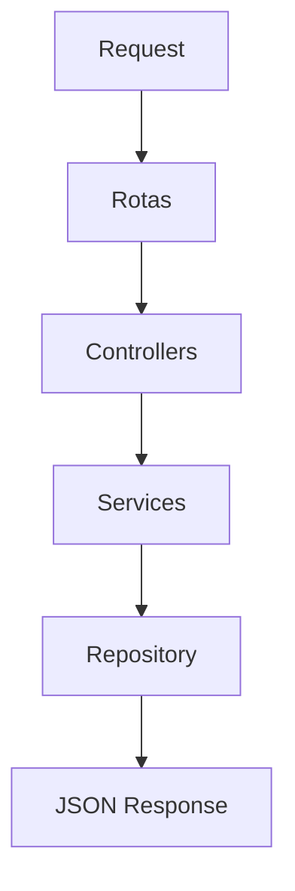

## Por que isso importa

Em entrevista: “onde fica a validação?”. Se a validação só existe no frontend, a API aceita lixo via curl. Se o SQL mora no controller, você não consegue reutilizar nem testar a regra sem HTTP.

## O que quebra se fizer errado

- Validação só no React → burla fácil; dados corrompidos.
- Service devolvendo `res.status` → camadas grudadas; testes difíceis.
- Um “god controller” de 400 linhas → PR impossível de revisar.

## Exemplo um pouco mais rico — API de tarefas

```http
POST /tasks          → 201 { id, title } | 400 { error: "title_required" }
GET /tasks           → 200 { data: Task[] }
GET /tasks/:id       → 200 Task | 404
PATCH /tasks/:id     → 200 Task | 400 | 404
DELETE /tasks/:id    → 204 | 404
```

```ts
// service: regra + validação de domínio
function createTask(title: string) {
  const t = title.trim()
  if (!t) throw Object.assign(new Error('title_required'), { status: 400 })
  return repo.insert({ title: t })
}

// controller: traduz erro → HTTP
```

### Exercícios

#### Múltipla escolha

**Q1.** GET /tasks/:id tipicamente:

- (a) Cria
- (b) Lê ✅ **(gabarito)**
- (c) Formata CSS

**Q2.** Validação de input costuma ocorrer:

- (a) Antes da regra de negócio pesada ✅ **(gabarito)**
- (b) Só no DNS
- (c) Nunca

#### Questão de texto livre

Explique para um tech lead a diferença entre rota, controller, service e repository numa API de tarefas. O que acontece de ruim se a validação do título ficar só no frontend ou só no repository?

> Corrigida por agente de IA (pass/fail + feedback pedagógico).

#### Exercício de código

Store em memória: createTask(title), listTasks(), updateTask(id, title), deleteTask(id). IDs a partir de 1. Contrato extra: createTask com título vazio/só espaços deve lançar Error (validação antes de persistir).

**Código inicial:**

```ts
type Task = { id: number; title: string }
const tasks: Task[] = []
let seq = 1
export function createTask(title: string) { return { id: 0, title } }
export function listTasks() { return tasks }
export function updateTask(id: number, title: string) { return null as Task | null }
export function deleteTask(id: number) { return false }
```

**Testes automatizados:**

- `crud`
- `validate empty`


<a id="postgresql-sql"></a>

## 7. Aula: PostgreSQL e SQL de verdade

- **Slug:** `postgresql-sql`
- **Tipo:** aula

### Objetivos de aprendizagem

- Modelar relacionamentos
- Escrever SQL além do CRUD cego

### Conteúdo

## Por que SQL puro importa

ORMs ajudam, mas escondem joins, índices e transações. Em entrevista e produção, SQL aparece — “o Prisma gera” não basta se a query está lenta ou inconsistente.

## Relacionamentos

1:1, 1:N, N:N — sempre pergunte “quem depende de quem?”.

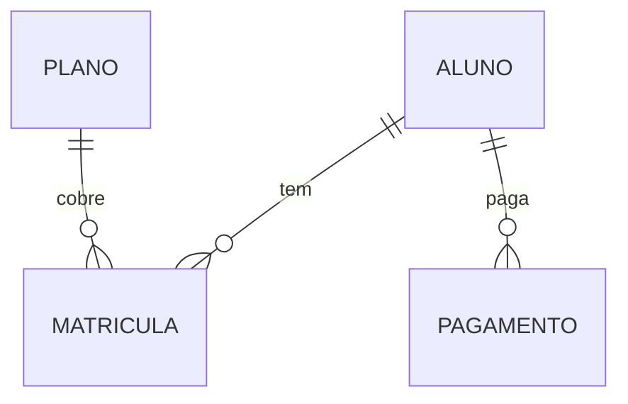

## Por que isso importa

Modelagem errada vira gambiarra eterna: relatório impossível, FK faltando, duplicata de matrícula. Índice certo transforma timeout em milissegundos; índice errado só atrasa escrita.

## Índices, JOINs e transações (o que a entrevista cobra)

- **JOIN**: combina tabelas relacionadas — não é “magia do ORM”.
- **Índice**: acelera filtro/ordenação em colunas quentes (`aluno_id`, email único). Não indexe tudo.
- **Transação**: matrícula + cobrança inicial = tudo-ou-nada. Sem isso, aluno matriculado sem pagamento (ou o contrário).

O que o ORM esconde e você precisa saber nomear: N+1 queries, migrate vs schema drift, isolation level básico.

## O que quebra se fizer errado

- Sem FK → órfãos no banco.
- Sem transação em operação composta → estado pela metade.
- SELECT * em tabela enorme sem índice → API “aleatoriamente lenta”.

## Exemplo um pouco mais rico

```sql
BEGIN;
INSERT INTO matriculas (aluno_id, plano_id) VALUES ($1, $2);
INSERT INTO pagamentos (aluno_id, valor_centavos) VALUES ($1, 9900);
COMMIT;

-- leitura com JOIN
SELECT a.nome, p.nome AS plano
FROM matriculas m
JOIN alunos a ON a.id = m.aluno_id
JOIN planos p ON p.id = m.plano_id
WHERE a.id = $1;

-- índice típico
CREATE INDEX matriculas_aluno_id_idx ON matriculas (aluno_id);
```

### Exercícios

#### Múltipla escolha

**Q1.** JOIN serve para:

- (a) Combinar tabelas relacionadas ✅ **(gabarito)**
- (b) Criptografar senhas
- (c) Fazer deploy

**Q2.** Transações ajudam a:

- (a) Garantir tudo-ou-nada ✅ **(gabarito)**
- (b) Escolher cor do botão
- (c) Trocar DNS

#### Questão de texto livre

Modele academia (alunos, planos, matrículas, pagamentos) e justifique as FKs. Em entrevista: quando você usaria índice e quando usaria transação? O que um ORM esconde que você ainda precisa entender?

> Corrigida por agente de IA (pass/fail + feedback pedagógico).

#### Exercício de código

Implemente countEnrollmentsByPlan(enrollments) → Record<planId, number>. Pense como um GROUP BY em memória.

**Código inicial:**

```ts
export function countEnrollmentsByPlan(enrollments: Array<{ planId: string }>): Record<string, number> {
  return {}
}
```

**Testes automatizados:**

- `group`


<a id="api-banco-integracao"></a>

## 8. Aula: Integração API + PostgreSQL

- **Slug:** `api-banco-integracao`
- **Tipo:** aula

### Objetivos de aprendizagem

- Usar pool e queries parametrizadas
- Evitar SQL Injection

### Conteúdo

## Conexão

Use **pool** de conexões. Abrir conexão TCP + auth a cada request é caro; o pool reutiliza.

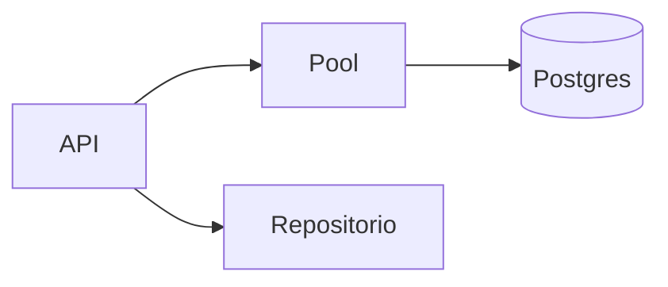

## Por que isso importa

SQL Injection ainda derruba sistemas reais. Em entrevista, “eu concateno a string” é sinal vermelho. Em produção, pool mal dimensionado = timeout sob carga.

## Ruim vs bom (lado a lado)

```ts
// RUIM — concatenação (SQL Injection)
await client.query("SELECT * FROM users WHERE email = '" + email + "'")
// email = "' OR '1'='1" → vaza a tabela

// BOM — parametrizado: o driver envia query e valores separados
await pool.query('SELECT * FROM users WHERE email = $1', [email])
```

O `$1` não é “só estilo”: o protocolo do Postgres trata o valor como **dado**, não como código SQL.

## Paginação: offset vs cursor (menção)

- `OFFSET/LIMIT` (page/pageSize): simples; fica lento em páginas profundas.
- **Cursor** (`WHERE id > $1 LIMIT n`): melhor em feeds grandes.

## O que quebra se fizer errado

- Concatenar input → dump ou destruição de dados.
- Sem pool → esgota conexões do Postgres.
- Migrar schema só “na mão no prod” → drift entre ambientes.

## Exemplo um pouco mais rico

```ts
export async function listBusinesses(page: number, pageSize: number) {
  const limit = Math.min(Math.max(pageSize, 1), 50)
  const offset = (Math.max(page, 1) - 1) * limit
  const { rows } = await pool.query(
    'SELECT id, name FROM businesses ORDER BY id LIMIT $1 OFFSET $2',
    [limit, offset],
  )
  const total = await pool.query('SELECT count(*)::int AS n FROM businesses')
  return { data: rows, total: total.rows[0].n, page, pageSize: limit }
}
```

### Exercícios

#### Múltipla escolha

**Q1.** SQL Injection mitiga-se com:

- (a) Concatenar input
- (b) Queries parametrizadas ✅ **(gabarito)**
- (c) Mais CSS

**Q2.** Migrations servem para:

- (a) Versionar schema do banco ✅ **(gabarito)**
- (b) Minificar JS
- (c) Gerar QR code

#### Questão de texto livre

Mostre um exemplo de SQL Injection (input malicioso) e como a parametrização ($1) impede. Explique para um tech lead por que pool existe (custo de conexão) e cite a diferença conceitual entre paginação offset e cursor.

> Corrigida por agente de IA (pass/fail + feedback pedagógico).

#### Exercício de código

Implemente buildPage(items, page, pageSize) → { data, total, page, pageSize } (page começa em 1). Contrato: page/pageSize inválidos (<=0) devem se comportar como page=1 e pageSize=1 no mínimo.

**Código inicial:**

```ts
export function buildPage<T>(items: T[], page: number, pageSize: number) {
  return { data: [] as T[], total: 0, page, pageSize }
}
```

**Testes automatizados:**

- `page2`
- `clamp`


<a id="avaliacao-mod-2"></a>

## 9. Avaliação: Avaliação — APIs e Bancos

- **Slug:** `avaliacao-mod-2`
- **Tipo:** avaliação

### Objetivos de aprendizagem

- Cobrir REST, SQL e integração segura API↔banco

### Conteúdo

## Avaliação do módulo 2

10 questões sobre APIs REST, modelagem SQL e integração com PostgreSQL (incluindo SQL Injection e migrations).

Precisa de 100% de acerto para avançar.

### Exercícios

#### Múltipla escolha

**Q1.** POST em REST costuma:

- (a) Criar recurso ✅ **(gabarito)**
- (b) Só ler
- (c) Apagar DNS

**Q2.** Controller idealmente:

- (a) Orquestra HTTP e delega regra ✅ **(gabarito)**
- (b) Guarda senha em texto puro
- (c) Renderiza Photoshop

**Q3.** PK significa:

- (a) Chave primária ✅ **(gabarito)**
- (b) Protocolo Kafka
- (c) Patch Kubernetes

**Q4.** FK liga:

- (a) Tabelas relacionadas ✅ **(gabarito)**
- (b) Cores hex
- (c) Fonts Google

**Q5.** N:N tipicamente usa:

- (a) Tabela intermediária ✅ **(gabarito)**
- (b) Apenas um boolean
- (c) CSS Grid

**Q6.** Pool de conexões:

- (a) Reutiliza conexões com o banco ✅ **(gabarito)**
- (b) Serve HTML estático
- (c) Assina JWT no browser

**Q7.** Parametrizar query evita:

- (a) SQL Injection ✅ **(gabarito)**
- (b) HTTP
- (c) Git

**Q8.** Índice no banco ajuda a:

- (a) Acelerar buscas ✅ **(gabarito)**
- (b) Colorir botões
- (c) Trocar tipografia

**Q9.** POST /tasks com title vazio. Onde a validação deve barrar e qual status típico?

- (a) Só no CSS do formulário; API retorna 200
- (b) Na API (service/controller), tipicamente 400 ✅ **(gabarito)**
- (c) No DNS; tipicamente 301

**Q10.** Matricular aluno e registrar pagamento inicial: por que transação + queries parametrizadas?

- (a) Tudo-ou-nada no estado + evitar SQL Injection nos valores ✅ **(gabarito)**
- (b) Para o frontend poder concatenar SQL com segurança
- (c) Porque índice substitui JOIN


---

# Módulo 3: Segurança e Qualidade

*Autenticação/autorização, testes automatizados e fluxo Git profissional.*

<a id="auth-autorizacao"></a>

## 10. Aula: Autenticação e autorização

- **Slug:** `auth-autorizacao`
- **Tipo:** aula

### Objetivos de aprendizagem

- Separar authN e authZ
- Proteger rotas com perfis

### Conteúdo

## AuthN vs AuthZ

- **Autenticação (AuthN)**: quem é você (login)
- **Autorização (AuthZ)**: o que você pode fazer (perfil/permissão)

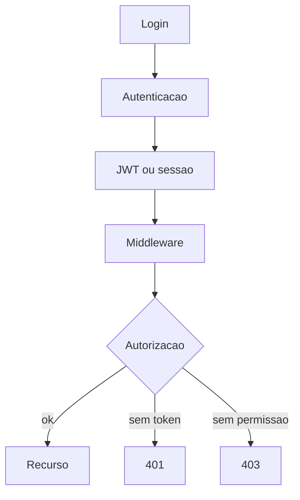

## Por que isso importa

Misturar 401 e 403 é erro clássico de quem veio do frontend. Produto, mobile e logs dependem dessa distinção. Em entrevista, “hash a senha” sem fluxo completo não convence.

## Fluxo JWT (visão prática)

1. Login valida email/senha (senha **hasheada** com bcrypt/argon2 — nunca texto puro)
2. Servidor emite JWT com claims mínimos: `sub` (user id), `role`, `exp`
3. Cliente envia `Authorization: Bearer ...`
4. Middleware verifica assinatura/expiração e anexa `user` no request
5. Handler checa AuthZ (admin vs member)

**Não coloque** no token: senha, dados sensíveis grandes, PII desnecessária — JWT costuma ser legível em base64 (só a assinatura protege integridade).

## O que quebra se fizer errado

- Senha em texto puro / hash fraco → vazamento catastrófico.
- Claims sensíveis no JWT → qualquer um lê no DevTools.
- Só AuthN sem AuthZ → membro acessa rota de admin.
- 401 quando o usuário está autenticado mas sem permissão → app manda “fazer login” em loop.

## Exemplo um pouco mais rico

```ts
// middleware
function requireAuth(req, res, next) {
  const user = verifyBearer(req.headers.authorization)
  if (!user) return res.status(401).json({ error: 'unauthenticated' })
  req.user = user
  next()
}

function requireAdmin(req, res, next) {
  if (req.user.role !== 'admin') {
    return res.status(403).json({ error: 'forbidden' })
  }
  next()
}
```

### Exercícios

#### Múltipla escolha

**Q1.** Autenticação responde:

- (a) Quem você é ✅ **(gabarito)**
- (b) Cor do tema
- (c) Qual fonte usar

**Q2.** 403 após login indica:

- (a) Falta de permissão ✅ **(gabarito)**
- (b) Sucesso
- (c) Created

#### Questão de texto livre

Explique autenticação vs autorização com exemplo aluno vs admin numa academia. No fluxo JWT: o que vai no token, o que NÃO deve ir, e quando usar 401 vs 403?

> Corrigida por agente de IA (pass/fail + feedback pedagógico).

#### Exercício de código

canAccess(role, resource): admin acessa tudo; member só "self". Pense como a checagem que o middleware/service faria após AuthN.

**Código inicial:**

```ts
export function canAccess(role: string, resource: string): boolean {
  return false
}
```

**Testes automatizados:**

- `admin`
- `member self`
- `member deny`


<a id="testes-automatizados"></a>

## 11. Aula: Testes automatizados

- **Slug:** `testes-automatizados`
- **Tipo:** aula

### Objetivos de aprendizagem

- Escrever testes unitários e de endpoint
- Cobrir erros

### Conteúdo

## Por que testar

Teste é rede de segurança para refatorar e demonstrar qualidade em portfólio. Em Backend, **caminho de erro** importa mais que o feliz: produção é feita de input estranho, timeout e permissão negada.

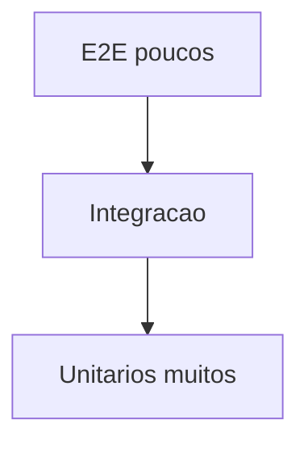

## Por que isso importa

Entrevista e PR de júnior: “você testou o 400/401/404?”. Um teste de endpoint valida status + body + efeito colateral mínimo — não só `expect(true)`.

## Quando mockar (e quando não)

| Mockar | Preferir real / integração |
|---|---|
| Gateway de e-mail, Stripe, HTTP externo | Regra de negócio pura |
| Relógio / UUID se flakiness | SQL crítico (com DB de teste) |
| Dependência lenta/instável | Contrato do seu repository com Postgres |

Mock demais = falso positivo. Zero mock em tudo = suite lenta e frágil.

## O que quebra se fizer errado

- Só testar sucesso → regressão em validação passa despercebida.
- Mockar o próprio código sob teste → teste inútil.
- E2E para tudo → CI lento e flaky; ninguém confia.

## Exemplo um pouco mais rico

```ts
it('rejects empty title with 400', async () => {
  const res = await request(app).post('/tasks').send({ title: '  ' })
  expect(res.status).toBe(400)
  expect(res.body.error).toBe('title_required')
})

it('creates task with 201', async () => {
  const res = await request(app).post('/tasks').send({ title: 'Estudar SQL' })
  expect(res.status).toBe(201)
  expect(res.body.id).toBeGreaterThan(0)
})
```

### Exercícios

#### Múltipla escolha

**Q1.** Teste de endpoint valida:

- (a) Camada HTTP da API ✅ **(gabarito)**
- (b) Somente CSS
- (c) Somente DNS

**Q2.** Cobrir erro importa porque:

- (a) Produção falha de formas reais ✅ **(gabarito)**
- (b) Aumenta cor do botão
- (c) Troca tipografia

#### Questão de texto livre

Quando mockar e quando preferir integração real? Por que, em Backend, testar o caminho de erro costuma valer mais que só o caminho feliz? O que um teste de endpoint realmente valida?

> Corrigida por agente de IA (pass/fail + feedback pedagógico).

#### Exercício de código

sumPositive(nums) soma apenas números > 0. Pense neste exercício como a unidade que um teste unitário cobriria antes do endpoint.

**Código inicial:**

```ts
export function sumPositive(nums: number[]): number {
  return 0
}
```

**Testes automatizados:**

- `sum`
- `empty`


<a id="git-fluxo-profissional"></a>

## 12. Aula: Git e fluxo profissional

- **Slug:** `git-fluxo-profissional`
- **Tipo:** aula

### Objetivos de aprendizagem

- Usar branches, commits claros e PRs
- Simular review mesmo solo

### Conteúdo

## Fluxo mínimo profissional

branch → commits → PR → review → merge.

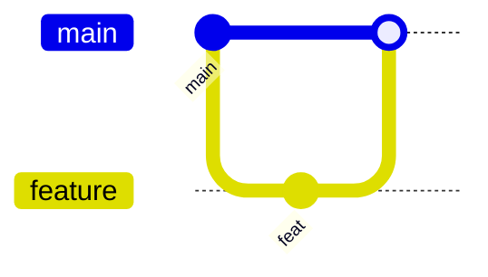

## Por que isso importa

Em time real (e em entrevista), ninguém lê “update” e “fix”. O PR é o seu cartão de visita: mensagem, tamanho e descrição mostram se você pensa como colega de time.

## O que um revisor espera num PR de júnior

1. **Commits** claros (`feat(api): add reviews endpoint`), não `asdf`
2. **PR pequeno** o suficiente para revisar em uma sentada
3. **Descrição**: o que mudou, por que, como testar (curl/testes)
4. Sem segredo, sem arquivo `.env`, sem 2000 linhas de formatação grátis

## O que quebra se fizer errado

- PR monstro → review superficial ou rejeição.
- Commit que mistura feature + refactor + lint → bisect impossível.
- Zero contexto na descrição → revisor assume o pior.

## Exemplo um pouco mais rico — descrição de PR

```md
## O que
Adiciona POST /businesses/:id/reviews com auth obrigatória.

## Por quê
Usuários autenticados precisam avaliar comércios.

## Como testar
- npm test
- curl -H "Authorization: Bearer ..." -d '{"rating":5}' ...

## Notas
Retorna 401 sem token, 404 se business não existe, 400 se rating fora de 1–5.
```

### Exercícios

#### Múltipla escolha

**Q1.** PR serve para:

- (a) Revisar e integrar mudanças ✅ **(gabarito)**
- (b) Apagar o remoto
- (c) Substituir testes

**Q2.** Branch feature isola:

- (a) Trabalho em progresso ✅ **(gabarito)**
- (b) O banco de produção
- (c) O DNS

#### Questão de texto livre

Escreva um commit bom e um ruim para a mesma mudança. Depois, liste o que um revisor espera ver na descrição de um PR de júnior (tamanho, testes, contexto).

> Corrigida por agente de IA (pass/fail + feedback pedagógico).

#### Exercício de código

parseConventionalCommit(msg) → { type, scope, breaking }. Útil para entender o padrão que times esperam nas mensagens.

**Código inicial:**

```ts
export function parseConventionalCommit(msg: string): { type: string; scope: string | null; breaking: boolean } {
  return { type: '', scope: null, breaking: false }
}
```

**Testes automatizados:**

- `scope`
- `breaking`


<a id="avaliacao-mod-3"></a>

## 13. Avaliação: Avaliação — Segurança e Qualidade

- **Slug:** `avaliacao-mod-3`
- **Tipo:** avaliação

### Objetivos de aprendizagem

- Cobrir auth, testes e Git do módulo

### Conteúdo

## Avaliação do módulo 3

10 questões sobre autenticação/autorização, testes e fluxo Git. 100% para avançar.

### Exercícios

#### Múltipla escolha

**Q1.** AuthN responde:

- (a) Quem é você ✅ **(gabarito)**
- (b) Qual cor usar
- (c) Qual fonte

**Q2.** AuthZ responde:

- (a) O que pode fazer ✅ **(gabarito)**
- (b) Qual emoji
- (c) Qual CDN

**Q3.** Senha deve ser:

- (a) Hasheada ✅ **(gabarito)**
- (b) Texto puro no repo
- (c) Enviada no CSS

**Q4.** JWT tipicamente carrega:

- (a) Claims do usuário ✅ **(gabarito)**
- (b) Arquivos MP4
- (c) Binários do SO

**Q5.** Middleware de auth age:

- (a) Antes do handler protegido ✅ **(gabarito)**
- (b) Depois do deploy físico
- (c) No Photoshop

**Q6.** Teste unitário foca:

- (a) Unidade isolada ✅ **(gabarito)**
- (b) Datacenter inteiro
- (c) Somente tipografia

**Q7.** Mock serve para:

- (a) Simular dependência ✅ **(gabarito)**
- (b) Apagar banco
- (c) Gerar CSS

**Q8.** PR facilita:

- (a) Code review ✅ **(gabarito)**
- (b) Esconder histórico
- (c) Remover HTTPS

**Q9.** Usuário autenticado (JWT válido) acessa rota admin sem perfil. Status correto:

- (a) 401 — pedir login de novo
- (b) 403 — autenticado, sem permissão ✅ **(gabarito)**
- (c) 201 — criado com sucesso

**Q10.** PR de júnior com 40 arquivos misturando feature, formatação e .env. Principal problema?

- (a) Difícil de revisar, risco de segredo e histórico sujo ✅ **(gabarito)**
- (b) Falta de Kubernetes no Diff
- (c) Commits convencionais são proibidos


---

# Módulo 4: Mercado e Portfólio

*Docker, deploy, projeto de comércios locais, ciclo de estudos e entrevistas.*

<a id="docker-containers"></a>

## 14. Aula: Docker na prática

- **Slug:** `docker-containers`
- **Tipo:** aula

### Objetivos de aprendizagem

- Diferenciar imagem e container
- Subir API + Postgres com Compose

### Conteúdo

## Ideia

Mesmo ambiente na sua máquina e no servidor — o clássico **“funciona na minha máquina”** some quando API + Postgres sobem iguais via Compose.

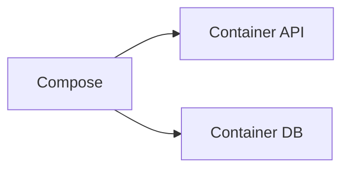

## Por que isso importa

Imagem = receita empacotada. Container = processo em execução a partir da imagem. Compose resolve a orquestração local: rede, env, dependência `api` espera `db`, volumes.

## Dockerfile mínimo decente (Node)

```dockerfile
FROM node:22-alpine AS deps
WORKDIR /app
COPY package*.json ./
RUN npm ci

FROM node:22-alpine
WORKDIR /app
ENV NODE_ENV=production
COPY --from=deps /app/node_modules ./node_modules
COPY . .
EXPOSE 3000
CMD ["node", "dist/server.js"]
```

## O que quebra se fizer errado

- Copiar `.env` com segredo para a imagem → vazamento no registry.
- `npm install` em prod sem lock → builds não reproduzíveis.
- API sobe antes do Postgres sem healthcheck → crash loop.

## Exemplo um pouco mais rico — Compose (ideia)

```yaml
services:
  db:
    image: postgres:16
    environment:
      POSTGRES_PASSWORD: example
  api:
    build: .
    ports: ["3000:3000"]
    environment:
      DATABASE_URL: postgres://postgres:example@db:5432/app
    depends_on: [db]
```

### Exercícios

#### Múltipla escolha

**Q1.** Dockerfile define:

- (a) Como construir a imagem ✅ **(gabarito)**
- (b) Preço da VPS
- (c) Cor do botão

**Q2.** Compose orquestra:

- (a) Vários serviços juntos ✅ **(gabarito)**
- (b) Somente fontes
- (c) Somente CSS

#### Questão de texto livre

Explique imagem vs container e por que Compose importa no dia a dia (“funciona na minha máquina”). O que um Dockerfile decente de Node precisa evitar (segredos, dependências)?

> Corrigida por agente de IA (pass/fail + feedback pedagógico).

#### Exercício de código

parseEnvLine(line): KEY=VALUE ou null para vazio/#. Útil ao pensar em env de container sem commit de segredo.

**Código inicial:**

```ts
export function parseEnvLine(line: string): [string, string] | null {
  return null
}
```

**Testes automatizados:**

- `ok`
- `comment`


<a id="deploy-producao"></a>

## 15. Aula: Deploy e produção

- **Slug:** `deploy-producao`
- **Tipo:** aula

### Objetivos de aprendizagem

- Publicar API com healthcheck e env
- Entender CORS e migrations em prod

### Conteúdo

## Checklist mínimo — e o que quebra se esquecer

| Item | Se esquecer |
|---|---|
| Build/artefato | Sobe código quebrado ou desatualizado |
| Env / secrets | App sobe sem DB ou com chave errada |
| CORS | “Funciona no curl, morre no browser” |
| Healthcheck | Orquestrador manda tráfego para morto |
| Migrations | Schema drift; 500 em toda query nova |
| Logs | Incidente sem pista |
| HTTPS / domínio | Dados e tokens em claro ou URL errada |

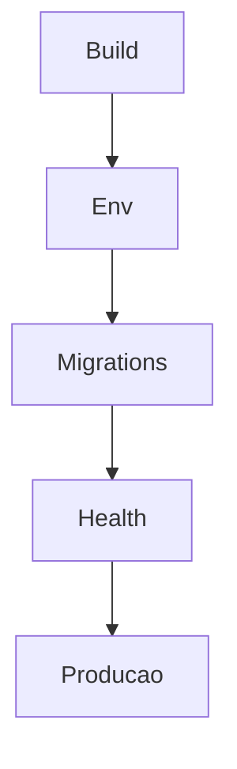

## Por que isso importa

Deploy não é “botão verde”. É reduzir a chance do primeiro usuário achar o bug que você não testou. Em entrevista, saber o *porquê* de cada item do checklist pesa mais que citar ferramentas.

## O que quebra se fizer errado

- Migration destrutiva sem backup → perda de dados.
- Log com PII/senha → vazamento em ferramenta de log.
- Health que só retorna 200 sem checar DB → “saudável” mentiroso.

## Exemplo um pouco mais rico

```ts
app.get('/health', async (_req, res) => {
  try {
    await pool.query('SELECT 1')
    res.json({ status: 'ok', version: process.env.APP_VERSION ?? 'dev' })
  } catch {
    res.status(503).json({ status: 'degraded', version: process.env.APP_VERSION ?? 'dev' })
  }
})
```

### Exercícios

#### Múltipla escolha

**Q1.** Health check serve para:

- (a) Ver se o serviço está saudável ✅ **(gabarito)**
- (b) Criptografar imagens
- (c) Escolher fonte

**Q2.** CORS controla:

- (a) Quem no browser pode chamar a API ✅ **(gabarito)**
- (b) O preço do domínio
- (c) A tipografia

#### Questão de texto livre

Monte um checklist de go-live com pelo menos 6 itens. Para cada item, diga em uma frase o que quebra em produção se você esquecer.

> Corrigida por agente de IA (pass/fail + feedback pedagógico).

#### Exercício de código

healthPayload(ok, version) → status ok|degraded + version. Espelha o contrato que o orquestrador / monitor consome.

**Código inicial:**

```ts
export function healthPayload(ok: boolean, version: string) {
  return { status: 'degraded', version }
}
```

**Testes automatizados:**

- `ok`
- `deg`


<a id="projeto-api-comercios"></a>

## 16. Aula: Projeto: API de comércios locais

- **Slug:** `projeto-api-comercios`
- **Tipo:** aula

### Objetivos de aprendizagem

- Evoluir uma API real ao longo do curso
- Usar Postgres sem esconder o Backend

### Conteúdo

## Ideia transversal

API inspirada no AondeTem: businesses + reviews + auth. O portfólio vale pelo que você **explica**, não só pela lista de endpoints.

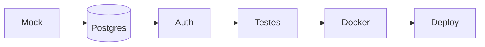

## Endpoints

```
POST /auth/register
POST /auth/login
GET/POST/PATCH/DELETE /businesses
GET/POST /businesses/:id/reviews
```

## Por que isso importa

Em entrevista de Backend júnior, vão perguntar: modelagem (por que reviews N:1 com business?), auth (hash, 401/403), erros (404 vs 400), testes e como sobe. Supabase pode hospedar Postgres — você ainda precisa entender as operações.

## O que você deve conseguir explicar (roteiro de entrevista)

1. Por que `reviews.business_id` é FK e não texto solto
2. O que acontece no POST review sem token / com business inexistente / rating inválido
3. Onde está a regra de negócio vs o SQL
4. Um teste de erro que você escreveu
5. Como rodar local (Compose) e o que é o healthcheck

## O que quebra se fizer errado

- CRUD sem auth em reviews → spam e abuso.
- Esconder tudo atrás de “magia Supabase” sem saber SQL → trava na entrevista.
- README só com prints → recrutador não vê Backend.

## Exemplo um pouco mais rico — POST review

```http
POST /businesses/b1/reviews
Authorization: Bearer <jwt>
{ "rating": 5, "comment": "Ótimo atendimento" }

→ 201 { "id": "...", "rating": 5 }
→ 401 sem token
→ 404 business inexistente
→ 400 rating fora de 1–5
```

### Exercícios

#### Múltipla escolha

**Q1.** Neste projeto, Supabase deve:

- (a) Esconder todo o Backend
- (b) Pode ser Postgres desde que você entenda ✅ **(gabarito)**
- (c) Ser proibido

**Q2.** Qualidade do portfólio prioriza:

- (a) Qualidade técnica ✅ **(gabarito)**
- (b) Só quantidade de telas
- (c) Evitar README

#### Questão de texto livre

Desenhe o fluxo de POST /businesses/:id/reviews (auth, validação, persistência, status codes). Liste 4 decisões do projeto que você saberia defender numa entrevista de Backend júnior.

> Corrigida por agente de IA (pass/fail + feedback pedagógico).

#### Exercício de código

normalizeSlug(name): lowercase, espaços→-, remove não alfanuméricos. Contrato típico de campo derivado na API de comércios.

**Código inicial:**

```ts
export function normalizeSlug(name: string): string {
  return ''
}
```

**Testes automatizados:**

- `slug`


<a id="ciclo-estudo-entrevistas"></a>

## 17. Aula: Ciclo de estudos e entrevistas

- **Slug:** `ciclo-estudo-entrevistas`
- **Tipo:** aula

### Objetivos de aprendizagem

- Aplicar ciclo 20/20/40/10
- Usar entrevistas para achar lacunas

### Conteúdo

## Ciclo diário

20 conceito · 20 exemplos · 40 exercício · 10 revisão.

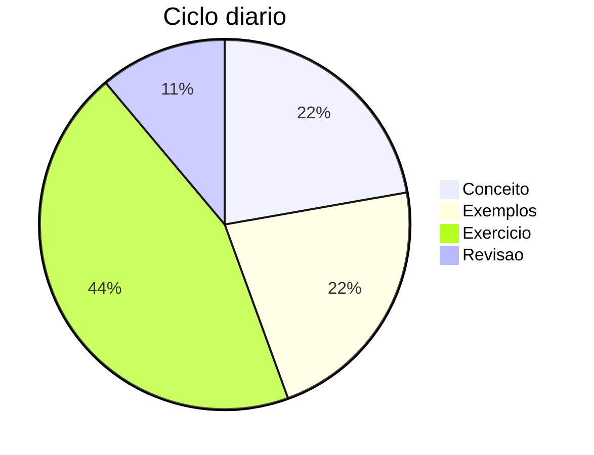

## Por que isso importa

Entrevistas de Backend júnior cobram, de forma recorrente: **HTTP/status**, **SQL (JOIN/índice/transação)**, **auth (401 vs 403, hash)**, **Git/PR**. O ciclo 40min de exercício é onde isso vira músculo — vídeo sozinho não.

## O que quebra se fizer errado

- Só consumir conteúdo → falsa confiança.
- Evitar entrevistas até “100% pronto” → atrasa o diagnóstico das lacunas reais.
- Revisar zero → esquece o que estudou ontem.

## Exemplo um pouco mais rico — amarrando ao mercado

| Fatia | Exemplo alinhado a entrevista |
|---|---|
| 20 conceito | Ler sobre índices / anotar trade-offs |
| 20 exemplos | Reescrever query ruim → boa |
| 40 exercício | Implementar endpoint + teste de 400 |
| 10 revisão | Explicar em voz alta 401 vs 403 |

Candidate-se antes de se sentir 100% pronto. Cada entrevista revela o próximo tópico de estudo.

### Exercícios

#### Múltipla escolha

**Q1.** Maior fatia do ciclo:

- (a) Exercício 40min ✅ **(gabarito)**
- (b) Revisão 10min
- (c) Só vídeo

**Q2.** Sobre candidatar-se:

- (a) Esperar 100% pronto
- (b) Começar antes de se sentir 100% pronto ✅ **(gabarito)**
- (c) Evitar entrevistas

#### Questão de texto livre

Adapte o ciclo 20/20/40/10 a um dia real seu, conectando cada fatia ao que aparece em entrevistas de Backend júnior (SQL, HTTP, auth, Git). Quais lacunas você atacaria após uma entrevista ruim?

> Corrigida por agente de IA (pass/fail + feedback pedagógico).

#### Exercício de código

groupBy(items, keyFn) agrupa em Record<string, T[]>. Útil como exercício de dados — o tipo de manipulação que aparece em services.

**Código inicial:**

```ts
export function groupBy<T>(items: T[], keyFn: (i: T) => string): Record<string, T[]> {
  return {}
}
```

**Testes automatizados:**

- `group`


<a id="avaliacao-mod-4"></a>

## 18. Avaliação: Avaliação — Mercado e Portfólio

- **Slug:** `avaliacao-mod-4`
- **Tipo:** avaliação

### Objetivos de aprendizagem

- Cobrir Docker, deploy, projeto e método de estudos/entrevistas

### Conteúdo

## Avaliação final do módulo 4

10 questões sobre Docker, produção, o projeto de comércios e o ciclo de estudos/entrevistas. 100% para concluir o módulo.

### Exercícios

#### Múltipla escolha

**Q1.** Container é:

- (a) Instância em execução de uma imagem ✅ **(gabarito)**
- (b) Um arquivo CSS
- (c) Um registro DNS

**Q2.** Compose ajuda a:

- (a) Subir vários serviços juntos ✅ **(gabarito)**
- (b) Escolher tipografia
- (c) Gerar QR

**Q3.** Healthcheck em produção:

- (a) Indica saúde do serviço ✅ **(gabarito)**
- (b) Minifica HTML
- (c) Troca tema

**Q4.** Migration em prod deve ser:

- (a) Planejada e versionada ✅ **(gabarito)**
- (b) Feita no CSS
- (c) Ignorada sempre

**Q5.** CORS protege principalmente:

- (a) Chamadas cross-origin no browser ✅ **(gabarito)**
- (b) O cabo de rede
- (c) A tipografia

**Q6.** Projeto AondeTem-like prioriza:

- (a) Evolução Backend real ✅ **(gabarito)**
- (b) Só mock eterno
- (c) Evitar SQL

**Q7.** Reviews de comércio ficam em:

- (a) Endpoints dedicados na API ✅ **(gabarito)**
- (b) Somente no CSS
- (c) No favicon

**Q8.** Ciclo 40min é para:

- (a) Exercício sem copiar ✅ **(gabarito)**
- (b) Só scroll infinito
- (c) Deploy automático de tipografia

**Q9.** Você esquece CORS e migrations no go-live. Sintomas mais prováveis?

- (a) Browser bloqueia a API; queries novas quebram por schema drift ✅ **(gabarito)**
- (b) Docker deixa de existir
- (c) Git rejeita commits convencionais

**Q10.** Na entrevista, pedem para explicar POST /businesses/:id/reviews. O que mais demonstra Seniority júnior sólida?

- (a) Listar só os nomes dos endpoints sem status codes
- (b) Explicar auth, validação, FK, 401/404/400 e um teste de erro ✅ **(gabarito)**
- (c) Dizer que o Supabase elimina a necessidade de Backend


---

_Fim do documento. Total de unidades: 18._
